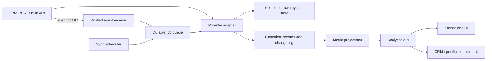

# Product and backend architecture

Status: proposed design, 2026-09-30.

## Product boundary

Customers connect one or more CRM accounts and authorize read access. The service copies the approved data into a tenant-isolated analytical store, computes consistently defined metrics, and displays results in a standalone dashboard or a CRM extension. An embedded view is a presentation channel: the ingestion and analytics backend remain the same. The first release does not modify CRM records.

The product's analytical model has two axes: **commercial outcomes** (sales, purchases, and later other money-bearing processes) and **non-commercial work** (meetings, calls, visits, negotiations, tasks, and other activities). The central question is how work relates to outcomes over time, by person, customer, and process. A CRM deal is not automatically a purchase; direction must come from an explicit provider mapping or customer configuration.

The design targets Bitrix24, Kommo (amoCRM), HubSpot, Pipedrive, Salesforce, Zoho CRM, and Microsoft Dynamics 365 Sales/Dataverse. This is a representative connector set, not a claim that every CRM or edition supports identical capabilities. See [connector research](connectors.md).

## Data movement

Recommended sequence for a new connection:

1. Complete provider authorization and discover account identity, available objects, fields, pipelines, stages, users, timezone, and currency settings.
2. Register change notifications where supported. Start recording events before or during backfill, then replay them after the snapshot; use a safe overlap window. Provider behavior must be tested in a sandbox.
3. Backfill selected objects in pages or bulk exports with a durable cursor. Preserve source IDs and source timestamps.
4. Process notifications as hints to fetch current records or apply an authoritative CDC event, including deletes where supported.
5. Run incremental scans and scheduled reconciliation to recover missed events, expired subscriptions, permission changes, and deletes that the provider cannot report directly.
6. Build metrics from committed normalized records; publish connection freshness and coverage with the results.

## Canonical model

The minimum cross-provider model is `User`, `Lead`, `Contact`, `Company`, `CommercialItem`, `Pipeline`, `Stage`, `Activity`, `Task`, and typed relationships. A `CommercialItem` has an explicit direction (`sale`, `purchase`, or `unclassified`), amount, currency, state, and owner; it can originate from a deal, order, invoice, or a configured custom process. An `Activity` has a type, responsible person, planned and actual times, completion state, and links to people or commercial items. Preserve provider custom fields in a namespaced JSON extension until they are explicitly mapped. Store external IDs as strings. Use `(tenant_id, connection_id, object_type, external_id)` as the source identity key; names and email addresses are not unique IDs.

Keep three representations with separate retention policies:

- **Restricted raw payloads:** encrypted or access-controlled copies for debugging and reprocessing, with short configurable retention and sensitive-field redaction where feasible.
- **Canonical current state:** upserted records, soft-delete markers, relationships, source timestamps, sync timestamps, and field provenance.
- **Change history:** actual observed transitions with source event ID or comparison evidence. The date a connector first sees a deal in a stage is not necessarily the date it entered that stage.

The first release should avoid storing message bodies, call recordings, attachments, and arbitrary personal data unless a specific metric needs them and the customer explicitly approves them. Read-only scopes and field selection should be minimized accordingly.

## Analytics semantics

Define metrics in versioned code and document their inputs. The first dashboard should show the two axes separately and together: commercial counts/value by direction, currency, pipeline and owner; activity counts by type, owner and completion; and linked work per commercial item. A relationship is causal only if there is evidence and a defined time window—do not label correlation as contribution. For each metric specify denominator, filters, timezone, missing-field behavior, and whether historical changes are available. Currency totals must either be grouped by currency or converted using an explicitly selected rate source and effective date; never silently sum different currencies. Stage history and conversion funnels must start at connection time unless the CRM exposes usable history or the customer imports historical events.

## Multi-tenant and operational boundaries

All tables, queues, object storage paths, and logs carry tenant/connection context. Enforce tenant filtering in the data layer and in authorization, not only at HTTP routes. Use separate API credentials per CRM connection. Encrypt secrets at rest with managed key rotation. Verify each provider callback with its documented method or a per-connection secret; do not invent a universal signature scheme. Limit webhook body size, parse provider-specific formats, acknowledge only after durable enqueue, and process asynchronously.

Apply per-connection rate limiting and provider-specific retry rules. Honor `429` and `Retry-After` where supplied; use bounded exponential backoff with jitter for transient failures. Distinguish revoked credentials, forbidden objects, quota exhaustion, malformed data, and provider outages. Show sync state (`connecting`, `backfilling`, `live`, `degraded`, `reauthorization_required`, `disconnected`) and last successful sync per object. Alert on stale cursors and unprocessed events. Avoid claiming a fixed real-time SLA before measuring provider delivery and API limits.

## Deliberate exclusions for the first release

Bidirectional writeback, cross-tenant identity matching, predictive scoring, universal historical stage reconstruction, and automatic browser embedding across every CRM are future work. Each requires separate provider capabilities and product requirements.
